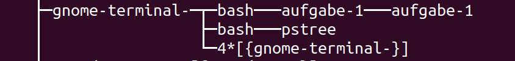
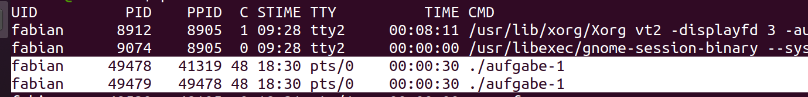
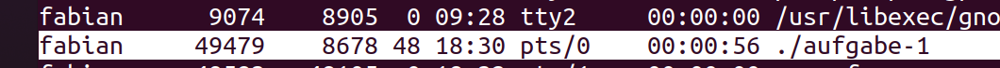

# Aufgabe 1
### Teil 1

    #include <stdio.h>
    #include <stdlib.h>
    #include <unistd.h>
    #include <sys/wait.h>

    int main () {
    if (fork () == 0) {
    //child process
    while(1) {
        printf("Child: pid->%ld ppid->%ld\n", (long)getpid(), (long)getppid());
    }
    } else {
    //parent
    while(1) {
        printf("Parent: pid->%ld\n", (long)getpid());
    }
    }

    return 0;
    }

### Teil 2
pstree:

ps -af:

### Teil 3
Der Child Prozess läuft auch nach Beendigung des Parent Prozesses weiter. Anstatt das abwechselnd vom Child und Parent der print Befehl ausgeführt wird, kommt nur noch der Child Prozess zum Zug. 

Vom Child verändert sich die PID nicht, aber natürlich ist die PPID nicht mehr die vorherige (einleuchtend, da der Parent Prozess gekillt wurde).

### Teil 4

    #include <stdio.h>
    #include <stdlib.h>
    #include <unistd.h>
    #include <sys/wait.h>
    #include <signal.h>

    //signal handler prototype
    void sigint_handler();

    //signal handler
    void sigint_handler() {
    printf("Macht’s gut und danke fuer den Fisch!\n");
    exit(EXIT_SUCCESS);
    }

    int main () {
    signal(SIGINT, sigint_handler);
    if (fork () == 0) {
        //child process
        while(1) {
        printf("Child: pid->%ld ppid->%ld\n", (long)getpid(), (long)getppid());
        }
    } else {
        //parent
        while(1) {
        printf("Parent: pid->%ld\n", (long)getpid());
        }
    }

    return 0;
    }

### Teil 5

